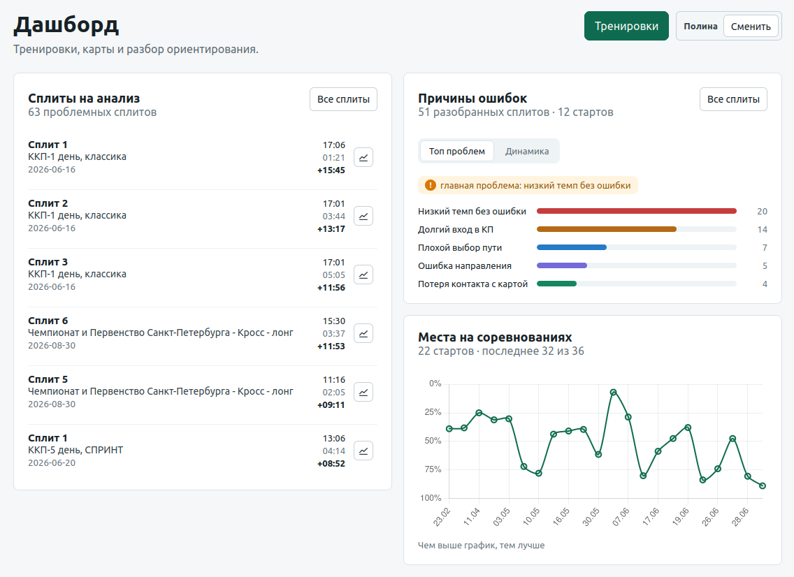
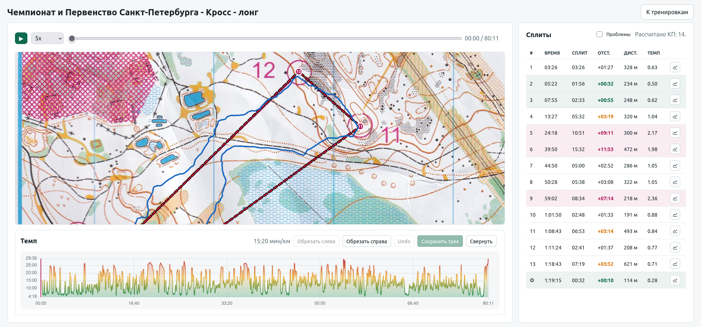
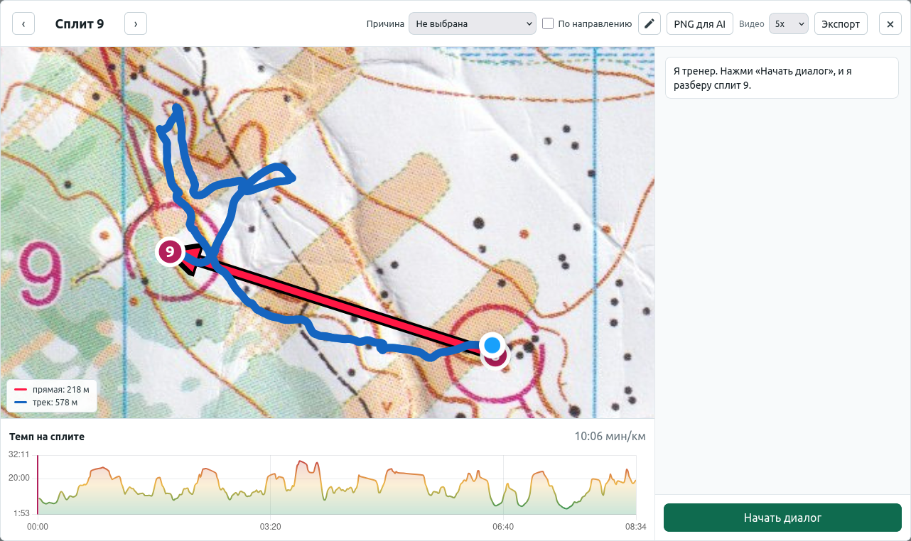

# Orienteering Portal

[](./LICENSE)

Локальный веб-портал для разбора тренировок и стартов по спортивному
ориентированию: сканы карт с привязкой к координатам, GPS-треки, протоколы
соревнований и разбор сплитов, вплоть до диалога с персональным AI-тренером
по каждому отдельному этапу дистанции.

Проект личный (family/staff use, без публичной регистрации): список
пользователей фиксирован в коде, вход — простой выбор пользователя без
пароля. Технологический стек и структура сознательно повторяют соседний
проект [`running-portal`](https://github.com/hram/running-portal).

> Статус: активная разработка. Разделы, для которых не нашлось материала в
> коде, отмечены как «требует уточнения».

## Что делает портал

1. **Тренировки.** Мастер создания тренировки: скан карты, геопривязка по
   контрольным точкам, GPS-трек (GPX), тип дистанции и заметки.
2. **Плеер трека.** Проигрывание движения по карте с изменяемой скоростью,
   перемоткой, отображением текущего темпа и обрезкой трека.
3. **Протоколы соревнований.** Импорт результатов по ссылке на
   `orgeo.ru`, `sportident.online` или сайты на движке `o-site.spb.ru`
   (включая PDF-протоколы SportOrg), сохранение и сравнение со всеми
   участниками группы.
4. **Разбор сплитов.** Автоматический расчёт сплитов по КП, подсветка
   проблемных этапов, сравнение с лидером/идеальными сплитами, дашборд
   «дороже всего по времени».
5. **AI-тренер.** Диалог по конкретному сплиту: в модель уходит снимок
   карты с треком и КП плюс параметры этапа, ответ — короткий разбор на
   русском для юной спортсменки.
6. **Опрос причин ошибок и аналитика.** Для каждого проблемного сплита
   можно сохранить причину потери времени (справочник причин настраивается
   в `/settings/error-reasons`); дашборд считает частоту причин, тренд по
   стартам и позиции в протоколах по датам.

Полный неформальный список возможностей (глазами владельца) — в
[`ВОЗМОЖНОСТИ_ПОРТАЛА.md`](./ВОЗМОЖНОСТИ_ПОРТАЛА.md).

## Скриншоты

### Дашборд



### Плеер тренировки



### Разбор сплита с AI-тренером



## Технологический стек

- **Backend:** Python 3.12+, [FastAPI](https://fastapi.tiangolo.com/),
  `uvicorn` (ASGI-сервер).
- **Шаблоны/frontend:** Jinja2 (`templates/`) + ванильный JS/CSS
  (`static/`), без сборки (no bundler); графики — Chart.js (CDN).
- **База данных:** SQLite через `aiosqlite`, схема и миграции —
  вручную в коде (`portal/db.py`), без ORM и без Alembic.
- **Геопривязка карт:** собственная реализация affine-преобразования
  (наименьшие квадраты) — `portal/services/georef.py`.
- **Парсинг GPX:** `xml.etree.ElementTree` (без внешней GPX-библиотеки).
- **Парсинг протоколов соревнований:** ручные regex/HTML-парсеры под пять
  форматов источников + `pypdf` для PDF-протоколов —
  `portal/services/race_protocol.py`.
- **AI-тренер:** не прямой вызов Anthropic API, а системный вызов
  установленного в контейнер `claude` (Claude Code CLI) как subprocess —
  подробности в [`docs/ai-coach.md`](./docs/ai-coach.md).
- **Тесты:** `pytest` + `pytest-asyncio` + `httpx` (`FastAPI TestClient`),
  ~109 тестов в `tests/`.
- **Деплой:** Docker (multi-stage: Node-слой для Claude CLI + Python
  3.12-slim), рассчитан на Coolify — см. [`docs/deployment.md`](./docs/deployment.md).

## Быстрый старт

### Требования

- Python 3.12+
- (опционально, для AI-тренера) установленный и авторизованный
  [Claude Code CLI](https://claude.com/product/claude-code)

### Установка

```bash
pip install -e ".[dev]"
cp .env.example .env
```

### Конфигурация (`.env`)

| Переменная | Назначение | По умолчанию (dev) |
| --- | --- | --- |
| `ORIENTEERING_PORTAL_DB_PATH` | Путь к файлу SQLite | `./data/orienteering.sqlite3` |
| `ORIENTEERING_PORTAL_UPLOAD_DIR` | Каталог загрузок (карты импорта, снимки сплитов) | `./data/uploads` |
| `ORIENTEERING_PORTAL_MAP_DIR` | Каталог карт (зарезервирован, отдельно от `maps`-таблицы) | `./data/maps` |
| `ORIENTEERING_PORTAL_AUTO_LOGIN` | Имя пользователя, под которым логинить автоматически без cookie (пусто — обязателен вход через `/login`) | не задано |
| `CLAUDE_CLI_PATH` | Путь к бинарю `claude` для AI-тренера | `/home/<user>/.local/bin/claude` (dev, зависит от машины разработчика) / `/usr/local/bin/claude` (Docker) |
| `ANTHROPIC_API_KEY` | Резервная авторизация Claude CLI (продакшн-пример) | не задано |
| `HOME` | В продакшн-примере переопределяется, чтобы Claude CLI искал креды в `/data/orienteering/.claude` | — |
| `PORT` | Порт uvicorn в контейнере | `8000` |

`.env.production.example` — шаблон для деплоя (Coolify), с портом 8000 и
путями `/data/orienteering/...` вместо `./data/...`.

### Запуск

```bash
uvicorn portal.main:app --reload --port 8002
```

При старте (`lifespan` в `portal/main.py`) приложение само создаёт нужные
каталоги, инициализирует схему SQLite и сеет данные по умолчанию: трёх
пользователей (двух обычных и одного админа — в коде под настоящими
именами владельца портала, здесь обезличено) и справочник причин ошибок
из 9 пунктов — см. [`docs/data-model.md`](./docs/data-model.md).

### Тесты

```bash
python -m pytest tests/ -v
```

## Структура репозитория

```
portal/
  main.py                 # FastAPI-приложение, middleware авторизации, дашборд
  auth.py                 # модель пользователя, работа с cookie-сессией
  db.py                   # схема SQLite, миграции, вся работа с данными (~2100 строк)
  infrastructure/
    config.py             # чтение переменных окружения
    media.py              # построение публичных /uploads-URL для картинок карт
  routers/
    auth.py                # /login, /logout
    imports.py              # мастер создания/редактирования тренировки, геопривязка карт
    race_results.py         # импорт/просмотр протоколов, сравнение сплитов
    georef.py                # /api/georef/fit — расчёт affine-преобразования
    ai.py                    # /api/split-analysis/chat — AI-тренер
    settings.py              # управление пользователями и причинами ошибок (admin)
  services/
    georef.py               # least-squares affine-геопривязка
    gpx.py                   # парсинг GPX-трека
    race_protocol.py          # парсинг протоколов (5 форматов) + запрос по сети
    race_grabber.py           # поиск стартов участника на o-site.spb.ru
templates/                 # Jinja2-страницы и partials
static/                    # JS/CSS без сборки, по одному файлу на экран/фичу
data/                       # SQLite-файл, загруженные карты/треки/снимки (в .gitignore, кроме .example-конфигов)
tests/                      # pytest, ~109 тестов
docs/                        # архитектура, модель данных, сценарии, интеграции, деплой
Dockerfile                  # multi-stage сборка (Node/Claude CLI + Python)
```

Подробности — в [`docs/`](./docs):

- [`docs/architecture.md`](./docs/architecture.md) — компоненты и как они взаимодействуют, ER-диаграмма.
- [`docs/data-model.md`](./docs/data-model.md) — таблицы и поля.
- [`docs/workflows.md`](./docs/workflows.md) — пользовательские сценарии по шагам.
- [`docs/ai-coach.md`](./docs/ai-coach.md) — как устроен AI-тренер.
- [`docs/integrations.md`](./docs/integrations.md) — импорт протоколов и внешние источники.
- [`docs/deployment.md`](./docs/deployment.md) — Docker/Coolify-деплой.
- [`docs/georeferencing.md`](./docs/georeferencing.md) — дизайн-документ по геопривязке карт (написан до реализации, частично устарел — см. пометки в `docs/architecture.md`).
- [`docs/ideas.md`](./docs/ideas.md) — бэклог идей владельца; часть уже реализована (см. пометки в `docs/workflows.md`).

## Лицензия

[MIT](./LICENSE)
