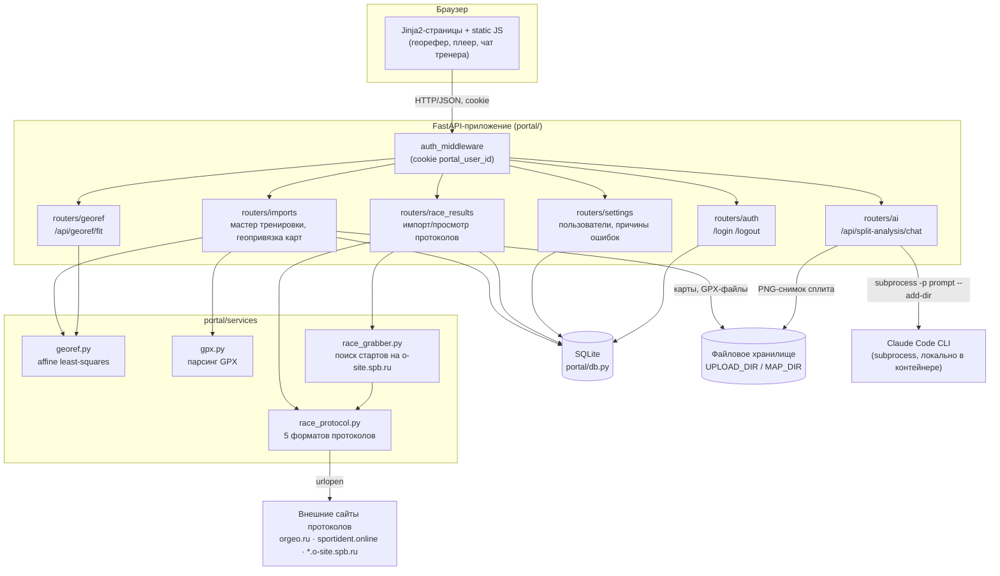

# Архитектура

## Обзор

Классическое серверное веб-приложение на FastAPI: один процесс, Jinja2
рендерит HTML на сервере, JS на страницах донастраивает интерактив (плеер
трека, геопривязка, чат с AI-тренером) через `fetch`-запросы к `/api/...`.
Полностью синхронный монолит без очередей/воркеров — все внешние вызовы
(парсинг протокола по HTTP, обращение к Claude CLI) выполняются прямо в
хендлере запроса (частично через `asyncio.to_thread` для блокирующего
сетевого I/O).



### Middleware авторизации

`auth_middleware` в `portal/main.py` — единственная точка входа авторизации:
для каждого запроса, кроме `whitelisted`-путей (`/login`, `/logout`,
`/favicon.ico`, `/static/*`, `/uploads/*`), ищет пользователя по cookie
`portal_user_id`, при отсутствии — по `ORIENTEERING_PORTAL_AUTO_LOGIN`
(автовход без cookie, для полностью доверенной LAN-инсталляции). Если
пользователь не найден — редирект на `/login` для HTML-страниц или `401
{"error": "not_authenticated"}` для `/api/*`. Найденный пользователь
кладётся в `request.state.user` и используется хендлерами (например, для
фильтрации данных по видимости, см. ниже, и для проверки `is_admin` в
`/settings/*`).

Отдельного пароля/секрета нет — модель доверия «кто добрался до порта в
локальной сети, тот и есть пользователь X, выбранный на экране логина».

### Видимость данных (multi-user на одной базе)

Тренировки и импортированные протоколы принадлежат «предметному»
пользователю (`subject_user_id` у драфта тренировки, автоопределение
спортсмена в протоколе по имени участника — см. `_seed_race_result_visibility`
в `portal/db.py`), но админ (единственный, по умолчанию) видит всё, а обычный
пользователь — только то, что видно ему через таблицы
`training_visibility` / `race_result_visibility`. Это не ACL в привычном
смысле, а простой список «кому эта запись видна», заполняемый один раз при
создании/импорте (см. `list_dashboard_race_results(conn, viewer_user_id=...)`).

## Схема данных (ER)

```mermaid
erDiagram
    users ||--o{ training_visibility : "видит"
    users ||--o{ race_result_visibility : "видит"
    users ||--o{ split_error_reviews : "не связано напрямую (нет FK), но пишется от лица текущего юзера"

    trainings ||--o| maps : "map_id (legacy, зеркало primary map_layers[0])"
    maps ||--o| map_georeferences : "map_id"
    trainings ||--o{ training_visibility : "training_id"
    trainings ||--o{ race_results : "training_id (может быть NULL — протокол без тренировки)"
    trainings ||--o| ai_analysis : "training_id (таблица в схеме есть, писать в неё сейчас некому — legacy/зарезервировано)"

    race_results ||--o{ race_result_visibility : "race_result_id"
    race_results ||--o{ split_error_reviews : "race_result_id (мягкая связь, без FK)"

    error_reasons ||--o{ split_error_reviews : "reason_id"

    training_import_drafts }o--o| trainings : "edit_training_id / finalized_training_id"

    users {
        text user_id PK
        text username UK
        text display_name
        int is_admin
    }
    maps {
        text map_id PK
        text title
        text image_path
        int image_width
        int image_height
    }
    map_georeferences {
        text map_id PK_FK
        text method
        text control_points_json
        text transform_json
        text residuals_json
    }
    trainings {
        text training_id PK
        text title
        text date
        text training_type
        text discipline
        text location
        text map_id FK
        text gpx_path
        text notes
        text course_controls_json "зеркало primary map_layers[0].course_controls"
        text track_points_json
        text map_layers_json "источник истины: список карт-слоёв"
    }
    training_import_drafts {
        text draft_id PK
        text title
        text date
        text map_image_path
        text georef_transform_json
        text course_controls_json
        text map_layers_json
        text track_gpx_path
        text track_points_json
        text edit_training_id FK
        text finalized_training_id FK
        text subject_user_id FK
    }
    race_results {
        text race_result_id PK
        text training_id FK
        text race_date
        text source_url
        text event_name
        text group_name
        text controls_json
        text participants_json
        int self_row_index
        text kind "course | score"
    }
    error_reasons {
        text reason_id PK
        text label
        int is_active
        int sort_order
    }
    split_error_reviews {
        text review_id PK
        text training_id
        text race_result_id
        text split_label
        text from_control_label
        text to_control_label
        text reason_id FK
        text custom_reason
        text reviewed_at
    }
    ai_analysis {
        text training_id PK_FK
        text analysis_json
    }
```

Подробное описание полей — [`data-model.md`](./data-model.md).

## Ключевые архитектурные решения

- **JSON-в-TEXT вместо нормализации.** Контрольные точки дистанции, точки
  трека, участники протокола, слои карт — везде большие JSON-блобы в
  текстовых колонках SQLite (`serialize_json`/`deserialize_json` в
  `portal/db.py`), а не отдельные таблицы. Оправдано объёмом данных одного
  локального портала и отсутствием необходимости в SQL-запросах внутрь этих
  структур.
- **Многослойные карты (`map_layers`).** Изначально тренировка имела одну
  карту (`maps`/`map_georeferences` + `trainings.map_id`). Позже добавлена
  поддержка нескольких слоёв карты на одну тренировку (JSON-массив
  `map_layers` в `trainings`/`training_import_drafts`) — например, разные
  куски дистанции сфотканы отдельно. Старые одно-карточные поля не удалены,
  а автоматически заполняются из «первого полного» слоя
  (`first_complete_map_layer`) — обратная совместимость с кодом/данными,
  написанным до многослойности.
- **Черновик → финализация.** Импорт тренировки — многошаговый мастер
  поверх `training_import_drafts` (карта → геопривязка → КП → трек →
  детали); ничего не попадает в `trainings`, пока пользователь не дойдёт до
  `POST /trainings/imports/{draft_id}/finish`, который вызывает
  `finalize_import_draft`. Тот же механизм переиспользуется для
  редактирования (`edit_training_id`) и клонирования (`create_clone_import_draft`)
  существующей тренировки.
- **AI-тренер как локальный CLI-процесс, а не HTTP-клиент к API.**
  Подробности и обоснование — в [`ai-coach.md`](./ai-coach.md).
- **Парсер протоколов — «угадай формат по форме», без единой схемы
  источника.** `detect_protocol_format` в `portal/services/race_protocol.py`
  различает 5 форматов по эвристикам в самом HTML/тексте (наличие
  `const db = "..."`, характерных CSS-классов sportident.online, маркеров
  PDF-протокола SportOrg) — см. [`integrations.md`](./integrations.md).

## Пограничные/устаревшие части (замечено при чтении кода)

- Таблица `ai_analysis` присутствует в схеме и в неё есть `DELETE` при
  удалении тренировки, но **ни одного `INSERT`/`UPDATE` в кодовой базе не
  найдено** — похоже на задел под будущую фичу (сохранённый анализ AI по
  тренировке целиком, а не по отдельному сплиту) либо остаток от более
  ранней версии AI-тренера. *Требует уточнения у автора.*
- `docs/georeferencing.md` в репозитории — дизайн-документ, написанный до
  реализации; по факту реализован только affine-этап оттуда (см.
  `portal/services/georef.py`), homography/TPS/tileset-уровни из документа
  не реализованы.
- Каталог `ORIENTEERING_PORTAL_MAP_DIR` (`./data/maps`) заведён как
  отдельная переменная окружения и каталог создаётся при старте, но
  файлы карт по факту сохраняются в `UPLOAD_DIR` (`data/uploads/imports/...`,
  `data/uploads/split-analysis/...`) — использование `MAP_DIR` в коде роутеров/сервисов
  не найдено. *Требует уточнения.*
